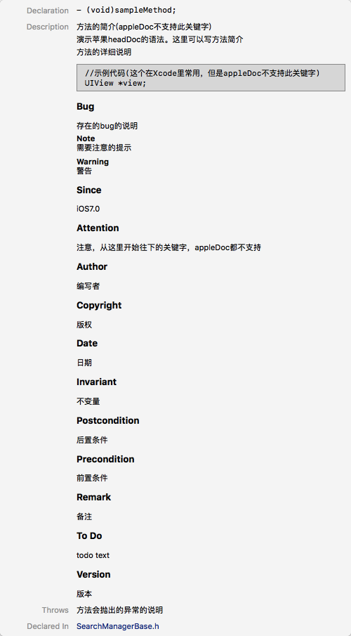

- [@inerface的11条规范写法](https://www.jianshu.com/p/d4110f582269)
- [objc@interface的设计哲学与设计技巧](http://blog.sunnyxx.com/2014/04/13/objc_dig_interface/)
- [2015 Objective-C 新特性](http://blog.sunnyxx.com/2015/06/12/objc-new-features-in-2015/)
- [Add @noescape to public library API](https://github.com/apple/swift-evolution/blob/master/proposals/0012-add-noescape-to-public-library-api.md)
- [Objective—C语言的新魅力——Nullability、泛型集合与类型延拓](https://my.oschina.net/u/2340880/blog/514804)
- [NS_ENUM & NS_OPTIONS(关于NS_ENUM和NS_OPTIONS的区别)](https://nshipster.cn/ns_enum-ns_options/)
- [Objective-C 拾遗：designated initializer](https://www.aliyun.com/jiaocheng/408531.html)
- [正确编写Designated Initializer的几个原则](https://www.jianshu.com/p/57db46f013d7)

# @inerface的11条规范写法

总结一些interface声明时的规范，相关宏的介绍，定义方法时有用的修饰符，编写注释的规范，最终写出一个合格的头文件。

## 1.读写权限
.h文件里的声明是用于暴露给外部的接口，而类内部的私有方法、私有属性和实例变量，应该放到.m文件的interface extension里。

### 1.1 实例变量的@public,@protected,@private关键字
这3个关键字用于修饰实例变量，不能用于修饰属性。当错误地使用了实例变量时，Xcode会报错提示。

| 关键字	     | 说明 |
| ---------  | ------------- |
| @private   | 作用范围只能在自身类 |
| @protected | 作用范围在自身类和继承自己的子类，什么都不写，默认是此属性。|
| @public    | 作用范围最大，在任何地方。|

示例代码：

```objc
//SearchManager.h
@interface SearchManager : NSObject {
    @public    NSInteger *state;
    @public    NSInteger *timeout;
    @protected id *searchAPI;
    @private   id _privateIvar;
}
@end
```
由于会暴露私有变量，并且没有@property的一些高级关键字，很少在头文件里声明实例变量。优先使用@property。

### 1.2 属性的readonly,readwrite关键字
头文件中的属性是用于描述这个对象的一系列特性集合。
声明@property时，在.h里使用readonly，让外部只有读的权限，在.m里使用readwrite，使内部拥有读写权限。

示例代码：

```
//SearchManager.h
@interface SearchManager : NSObject
@property (nonatomic, readonly) NSInteger * state;
@end


//SearchManager.m
@interface SearchManager ()
@property (nonatomic, readwrite) NSInteger * state;
@end
```

## 2.前向声明
当在@interface的接口里用到了其他类，不要在.h里直接导入类的头文件，这样会让使用此头文件的地方也导入这些不必要的其他头文件。正确的做法是使用关键字@class进行前向声明。当然，如果是继承了父类，还是需要import父类的头文件。
示例代码：

```objc
//SearchManager.h
#import "SearchManagerBase.h"//导入父类的头文件

@class LocationModel;//前向声明LocationModel类

typedef void(^LocationSearchCompletionHandler)(LocationModel *location, NSError *error);
@interface LocationSearchManager : SearchManagerBase
- (void)searchLocationWithKeyword:(NSString *)keyword completionHandler:(LocationSearchCompletionHandler)completionHandler;
@end
```

使用@class会告诉编译器有这么一个类存在，但是现在并不关心这个类的具体实现，等到调用者在.m里使用的时候再import这个类即可。使用@class和@protocol分别声明一个类和一个protocol。
使用前向引用的原因有两个：

- 提升编译效率。

    如果import了LocationModel.h，那么当LocationModel.h的内容发生变化时，所有import了LocationModel.h的地方都需要重新编译。如果.m引用了SearchManager.h，但是并没有使用LocationModel，就会增加不必要的编译，降低开发效率。

- 解决交叉引用的问题。

    如果类A的头文件import了B，类B的头文件import了A，这样在编译时会报错：“can not find interface declaration”，这是因为Objective-C不允许交叉引用。

## 3.只暴露必要的接口和实现
### 3.1不要暴露任何只在类内部使用的私有方法
头文件里只声明那些给外部使用的公开方法，并且在设计时需要考虑到可测试性，遵循单一职责。
私有方法只定义在类内部，并且为了进行区别，建议在私有方法前加上前缀，例如`- (void)p_myPrivateMethod。`
由于Apple在它的编码规范里声明了，Apple公司拥有下划线的方法前缀，就像它拥有NS,UI这些类名前缀一样，因此不建议我们的私有方法直接使用下划线作为前缀。否则，当你在继承Cocoa Touch的类时，有可能会覆盖父类的私有方法，造成难以调试的错误。

### 3.2不要在头文件里声明类内部遵循的protocol
错误的示例代码：

```
//SearchManager.h
@interface SearchManager : NSObject<NSCoding, UITableViewDelegate>
@property (nonatomic, readonly) NSInteger * state;
@end
```

`UITableViewDelegate`是类内部使用时遵循的`protocol`，没有必要暴露给外部，因此应该放到.m文件里。
而`NSCoding`则描述了类的特性，用于告诉外部本类可以使用归档，因此应该放在头文件里。


## 4.nullability说明
在声明时，可以使用下列关键字描述对象是否可以为nil。

| 关键字 | 说明 |
|------|------|
| nullable | 可空，用于描述objc对象
| nonnull | 不可空，用于描述objc对象
| null_unspecified | 不确定，用于描述objc对象
| null_resettable	set | 可空，get不为空。仅用于property
| _Nullable	 | 可空，用于描述C指针和block
| _Nonnull | 不可空，用于描述C指针和block
| \_Null\_unspecified | 不确定，用于描述C指针和block

示例代码：

```objc
//SearchManager.h
#import "SearchManagerBase.h"
@class LocationModel;

typedef void(^LocationSearchCompletionHandler)(LocationModel *_Nullable location, NSError *_Nullable error);
@interface LocationSearchManager : SearchManagerBase
- (void)searchLocationWithKeyword:(nonnull NSString *)keyword completionHandler:(LocationSearchCompletionHandler _Nonnull)completionHandler;
@end
```

如果向一个使用nonnull修饰的值赋空，编译器会给出警告。
在开发时，大部分时候使用的都是nonnull，因此Apple提供了一对宏NS_ASSUME_NONNULL_BEGIN和NS_ASSUME_NONNULL_END来进行快速修饰，写在两个宏之间的属性、方法，均会使用nonnull修饰。

示例代码：

```
//LocationSearchManager.h

#import "SearchManagerBase.h"
@class LocationModel;

NS_ASSUME_NONNULL_BEGIN
typedef void(^LocationSearchCompletionHandler)(LocationModel *_Nullable location, NSError *_Nullable error);
@interface LocationSearchManager : SearchManagerBase
- (void)searchLocationWithKeyword:(NSString *)keyword completionHandler:(LocationSearchCompletionHandler)completionHandler;
@end
NS_ASSUME_NONNULL_END
```

## 5.定义枚举
关于NS_ENUM和NS_OPTIONS的区别，参考[这里](https://nshipster.cn/ns_enum-ns_options/)。
简单来说，NS_OPTIONS提供了按位掩码的功能。

### 5.1 NS_ENUM

示例代码：

```
typedef NS_ENUM(NSInteger,SearchState) {
    SearchStateNotSearch,
    SearchStateSearching,
    SearchStateSearchFinished,
    SearchStateSearchFailed
};
```

### 5.2 NS_OPTIONS
示例代码，参考`NSKeyValueObserving.h`：

```objc
typedef NS_OPTIONS(NSUInteger, NSKeyValueObservingOptions) {
    NSKeyValueObservingOptionNew,
    NSKeyValueObservingOptionOld,
    NSKeyValueObservingOptionInitial,
    NSKeyValueObservingOptionPrior
};
```
在使用时就可以用|组合多个option：
`[_webView addObserver:self forKeyPath:@"title" options:NSKeyValueObservingOptionInitial | NSKeyValueObservingOptionNew context:NULL];`

### 5.3 字符串枚举
当使用字典作为参数传递，或者作为返回值时，往往难以直接提供字典的key，现在使用字符串枚举即可解决这个问题。
示例代码，参考`NSKeyValueObserving.h`：

```objc
//使用NS_STRING_ENUM宏，定义了一个枚举类型
typedef NSString * NSKeyValueChangeKey NS_STRING_ENUM;

FOUNDATION_EXPORT NSKeyValueChangeKey const NSKeyValueChangeKindKey;
FOUNDATION_EXPORT NSKeyValueChangeKey const NSKeyValueChangeNewKey;
FOUNDATION_EXPORT NSKeyValueChangeKey const NSKeyValueChangeOldKey;
FOUNDATION_EXPORT NSKeyValueChangeKey const NSKeyValueChangeIndexesKey;
FOUNDATION_EXPORT NSKeyValueChangeKey const NSKeyValueChangeNotificationIsPriorKey;

//使用泛型，声明了change参数用到的key，是在NSKeyValueChangeKey的枚举范围中
- (void)observeValueForKeyPath:(nullable NSString *)keyPath ofObject:(nullable id)object change:(nullable NSDictionary<NSKeyValueChangeKey, id> *)change context:(nullable void *)context;
```

## 6.使用extern向外部提供只读常量
这不关@interface的事，但是和头文件有关，就放在一起说明了。

```objc
//SearchManager.h
extern NSString *const SearchErrorDomain;
extern NSInteger SearchDefaultTimeout;

@interface SearchManager : NSObject
@end
```

```objc
//SearchManager.m
NSString *const SearchErrorDomain = @"SearchErrorDomain";
const NSInteger SearchDefaultTimeout = 20;

@interface SearchManager()
@end
```

### 7.向子类和category提供父类的私有属性
由于类的头文件只存放那些暴露给外部的属性和方法，在遇到这些情况时，会遇到障碍：
- 在子类里或者`category`里，想要使用父类定义在.m里的私有属性。
- 在类的头文件里属性是`readonly`，但是在子类或者`category`里，需要`readwrite`权限。
由于这些属性并没有暴露在头文件里，因此需要另外建立一个私有头文件，用来存放这些需要暴露给子类和`category`的属性。
可以参考Apple官方的`UIGestureRecognizerSubclass.h`。

```objc
//SearchManager.h
@interface SearchManager : NSObject
///外部访问，只有读权限
@property (nonatomic, readonly) SearchState state;
@end
```

```objc
//SearchManager.m
@interface SearchManager()
///内部使用，有读写权限
@property (nonatomic, assign) SearchState state;
///只在内部使用的私有属性
@property (nonatomic, strong) id searchAPI;
@end
```

```objc
///暴露给子类和category的私有属性和私有方法
//SearchManagerInternal.h
///限制使用此头文件，防止被别的类误用
#ifdef SEARCHMANAGER_PROTECTED_ACCESS

#import "SearchManager.h"
@interface SearchManager()
///在internal.h里，重新声明为readwrite权限
@property (nonatomic, readwrite, assign) SearchState state;
///暴露私有属性
@property (nonatomic, strong) id searchAPI;
///暴露私有方法
- (void)p_privateMethod;
@end

#else
#error Only be included by SearchManager's subclass or category!
#endif
```

```objc
///category的实现文件
//SearchManager+Category.m
///声明私有头文件的使用权限
#define SEARCHMANAGER_PROTECTED_ACCESS
///导入私有头文件
#import "SearchManagerInternal.h"

@implementation SearchManager(Category)
- (void)categoryMethod {
    //拥有了读写权限
    self.state = SearchStateSearching;
    //可以访问私有属性
    [self.searchAPI startSearch];
    //可以使用私有方法
    [self p_privateMethod];
}
@end
```

SearchManagerInternal.h其实也是公开的，其他类也能够导入并使用，只能在开发时进行约定。如果想要限制其他类导入，并且提示错误，Internal.h可以使用如下方式:

```objc
#ifdef MYCLASS_PROTECTED_ACCESS
//声明部分
#else
#error Only be included by MYCLASS's subclass or category!
#endif
```

这样在别的类内意外地导入了Internal.h时就会产生编译警告，并且无法直接使用。缺点是需要在所有使用到Internal.h的地方都#define MYCLASS_PROTECTED_ACCESS。

## 8.标明designated initializer

指定初始化方法，即接收参数最多的那个初始化方法，其他初始化方法调用它即可，这样设计的目的是为了保证所有初始化方法都正确地初始化实例变量。
在方法后面加上`NS_DESIGNATED_INITIALIZER`宏即可。这样，当你子类化这个类时，在子类的初始化方法里如果没有正确地调用父类的designated initializer，编译器就会给出警告。
实例代码：

```objc 
@interface WKWebView : UIView
- (instancetype)initWithFrame:(CGRect)frame configuration:(WKWebViewConfiguration *)configuration NS_DESIGNATED_INITIALIZER;
- (nullable instancetype)initWithCoder:(NSCoder *)coder NS_DESIGNATED_INITIALIZER;
@end
```

关于designated initializer更详细的说明，参考:

- [Objective-C 拾遗：designated initializer](https://www.aliyun.com/jiaocheng/408531.html)
- [正确编写Designated Initializer的几个原则](https://www.jianshu.com/p/57db46f013d7)

## 9.API版本控制
在更新接口，或者开发framework时，需要标明版本信息，告诉使用者此接口的平台限制、操作系统版本、是否可用、是否已弃用等。
苹果给出了几个自带的宏用于标明版本，Xcode在检测到错误使用时会给出警告。只需要在方法名后面加上对应的宏即可。

### 9.1 available
声明本接口最低支持的操作系统版本。
当你的接口使用了新系统的API，例如iOS8以上才有的UIAlertController，但是项目的deployment target却是iOS7时，需要标明此接口的版本信息，让使用者进行兼容。

示例:

```objc
//SearchManager.h

typedef NS_ENUM(NSInteger,SearchState) {
    SearchStateNotSearch,
    SearchStateSearching,
    SearchStateSearchFinished,
    SearchStateSearchFailed
} NS_ENUM_AVAILABLE_IOS(2_0);//此枚举在iOS2.0以上才能使用

NS_CLASS_AVAILABLE_IOS(2_0) //此类在iOS2.0以上才能使用
@interface SearchManager : NSObject
- (void)reSearch NS_AVAILABLE_IOS(5_0);//此方法在iOS5.0以上才能使用
@end
```

这几个宏有对应平台的版本，例如NS_AVAILABLE_MAC, NS_AVAILABLE_IOS, NS_AVAILABLE_IPHONE。
iOS10开始提供了新的available宏API_AVAILABLE，用来统一macOS、iOS、watchOS、tvOS几个平台。

```objc
API_AVAILABLE(macos(10.10))
API_AVAILABLE(macos(10.9), ios(10.0))
API_AVAILABLE(macos(10.4), ios(8.0), watchos(2.0), tvos(10.0))
```

### 9.2 unavailable
声明此接口不可用，大多数时候是用于声明所在平台限制。
示例：

```objc
@interface SearchManager : NSObject
- (void)searchInWatch NS_UNAVAILABLE;//不能用此接口
- (void)searchInHostApp NS_EXTENSION_UNAVAILABLE_IOS;//extension里不能用此接口
- (void)search __TVOS_PROHIBITED;//tvOS里不能用此接口，可修饰枚举，类，方法，参数
@end
```

iOS10开始提供了新的`unavailable`宏`API_UNAVAILABLE`:

```objc
API_UNAVAILABLE(macos)
API_UNAVAILABLE(watchos, tvos)
```

### 9.3 deprecated
声明此接口已经被弃用，可以同时加注释注明替代接口。
当deployment target版本号设置成大于或等于方法被弃用的版本号时，Xcode会给出警告。

示例:

```objc
//注明废弃类
NS_CLASS_DEPRECATED_IOS(2_0, 9_0, "UIAlertView is deprecated. Use UIAlertController with a preferredStyle of UIAlertControllerStyleAlert instead")
@interface UIAlertView : UIView
@end
```

```objc
//注明废弃API
@interface UIViewController : UIResponder
- (void)viewDidUnload NS_DEPRECATED_IOS(3_0,6_0);
@end
```

```objc
//注明废弃枚举
typedef NS_ENUM(NSInteger, UIStatusBarStyle) {
    UIStatusBarStyleDefault                                     = 0, // Dark content, for use on light backgrounds
    UIStatusBarStyleLightContent     NS_ENUM_AVAILABLE_IOS(7_0) = 1, // Light content, for use on dark backgrounds
    
    UIStatusBarStyleBlackTranslucent NS_ENUM_DEPRECATED_IOS(2_0, 7_0, "Use UIStatusBarStyleLightContent") = 1,
    UIStatusBarStyleBlackOpaque      NS_ENUM_DEPRECATED_IOS(2_0, 7_0, "Use UIStatusBarStyleLightContent") = 2,
}
```

iOS10开始提供了新的`deprecated`宏`API_DEPRECATED`和`API_DEPRECATED_WITH_REPLACEMENT`。
前者可以注明弃用原因，后者可以注明替代接口。

```objc
API_DEPRECATED("No longer supported", macos(10.4, 10.8))
API_DEPRECATED("No longer supported", macos(10.4, 10.8), ios(2.0, 3.0), watchos(2.0, 3.0), tvos(9.0, 10.0))

API_DEPRECATED_WITH_REPLACEMENT("-setName:", tvos(10.0, 10.4), ios(9.0, 10.0))
API_DEPRECATED_WITH_REPLACEMENT("SomeClassName", macos(10.4, 10.6), watchos(2.0, 3.0))
```

## 10.额外的修饰符
### 10.1 泛型
在声明时，对集合类型的对象增加泛型的修饰，就可以声明集合内存储的数据类型。
例如：

```objc
@property (nonatomic, strong) NSMutableArray<NSString *> *myArray;
```

当你向myArray里放入一个非NSString *类型的对象时，编译器会给出警告。

```objc
@property(nonatomic, strong) NSMutableArray<__kindof UIView *> * viewArray;
```

_kindof只限定了存储类型为UIView，因此也可以存储UIView的子类，例如UIButton。
更详细的介绍，参考:[Objective—C语言的新魅力——Nullability、泛型集合与类型延拓](https://my.oschina.net/u/2340880/blog/514804)

### 10.2 NS_REQUIRES_SUPER
NS_REQUIRES_SUPER宏用于声明子类在重载父类的这个方法时，需要调用父类的方法。例如：

```objc
- (void)viewWillAppear:(BOOL)animated NS_REQUIRES_SUPER;
```

### 10.3 NS_NOESCAPE
NS_NOESCAPE用于修饰方法中的block类型参数，例如：

```objc
@interface NSArray: NSObject
- (NSArray *)sortedArrayUsingComparator:(NSComparator NS_NOESCAPE)cmptr
@end
```

作用是告诉编译器，`cmptr`这个`block`在`sortedArrayUsingComparator:`方法返回之前就会执行完毕，而不是被保存起来在之后的某个时候再执行。
类似于这样的实现：

```objc
- (void)performWithLock:(NS_NOESCAPE void (^)())block {  // exposed as @noescape to Swift
    [myLock lock];
    block();
    [myLock unlock];
}
```

编译器知道之后，就会相应地做一些优化，例如去掉一些多余的对self的捕获、retain、release操作。因为block的存活范围仅限于本方法内，没有必要再在block内保留self了。
更详细的介绍，参考[这里](https://github.com/apple/swift-evolution/blob/master/proposals/0012-add-noescape-to-public-library-api.md)。

## 11.写注释
头文件就是文档，需要让使用者快速知道这个类的作用。一个好的方法名可以让使用者快速理解，但大部分时候还是需要相应的注释。
写好格式化注释后，当光标停留在方法名和属性上时，在`Xcode`右侧的`Quick Help`栏里会出现注释内容，按住`option`并单击，也会弹出注释框。

### 11.1单行注释
直接在方法或者属性声明的上一行使用`///`，后面加注释，同时兼容`Xcode`和`appleDoc`。`Xcode`也支持`//!`，但是`appleDoc`不支持。

```objc 
//SearchManagerBase.h

///搜索manager的基类
@interface SearchManagerBase : NSObject
///搜索状态
@property (nonatomic, readonly) NSInteger * state;
@end
```

### 11.2多行注释
多行注释使用：

```
/**
 注释内容
*/
```

`Xcode8`提供了快速生成格式化注释的快捷键：`option+command+/`。如果方法有参数，会自动添加`@param`关键字，用于描述对应的参数。
`Apple`提供了官方的`headDoc`语法，但是很多都已经在`Xcode`中失效了，而且有些关键字也和`appleDoc`不兼容。下面几种列举出了在`Xcode`中仍然有效的一些关键字：

```objc
/**
 演示苹果headDoc的语法。这里可以写方法简介
 
 @brief 方法的简介(appleDoc不支持此关键字)
 @discussion 方法的详细说明
 
 @code //示例代码(这个在Xcode里常用，但是appleDoc不支持此关键字)
 UIView *view;
 @endcode
 
 @bug       存在的bug的说明
 @note      需要注意的提示
 @warning   警告
 @since     iOS7.0
 @exception 方法会抛出的异常的说明
 
 @attention 注意，从这里开始往下的关键字，appleDoc都不支持
 @author    编写者
 @copyright 版权
 @date      日期
 @invariant 不变量
 @post      后置条件
 @pre       前置条件
 @remarks   备注
 @todo      todo text
 @version   版本
 */
- (void)sampleMethod;
```

在Xcode中，就会显示为这样：


### 11.3 枚举注释
如果要给枚举注释，需要在每个枚举值前注释，按照如下格式：

```objc
///搜索状态
typedef NS_ENUM(NSInteger,SearchState) {
    ///没有开始搜索
    SearchStateNotSearch,
    ///搜索中
    SearchStateSearching,
    ///搜索结束
    SearchStateSearchFinished,
    ///搜索失败
    SearchStateSearchFailed
};
```

### 11.4 几个注释约定
需要注释的内容：

- 尽量为类添加描述，即便只有一句话。
- 标明某些参数和属性的默认值，比如超时time。
- 如果属性是KVO兼容的，即外部可以使用KVO监听此属性，则在属性注释里声明。
- 回调block参数需要说明回调所在的线程，避免让使用者在block里进行多余的线程判断。
- 如果需要的话，说明使用此API需要的前置条件，防止被错误地调用。
- 对使用了method swizzling的API进行统一形式的标注，方便遇到runtime的bug时进行排查。


