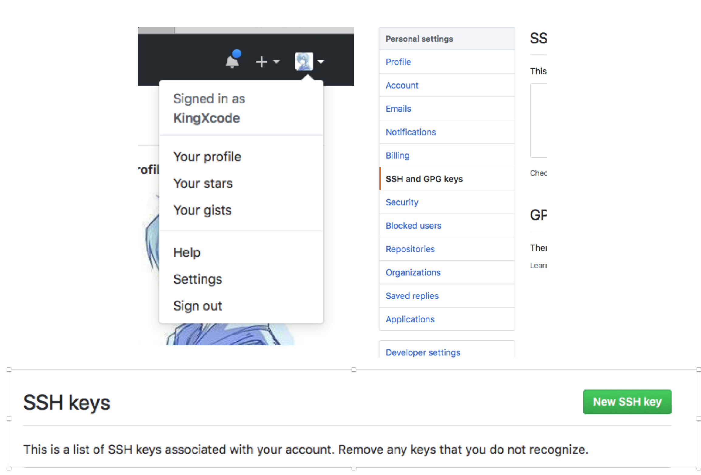
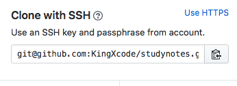

`显示隐藏文件夹快捷方式：command+shift+.`
`配置git用户`
1. `git config --global user.name  "xxx"`
2. `git config --global user.email "xxx@xxx.com"`

克隆仓库  
`git clone <版本库的网址>`

显示工作目录和暂存区的状态\
`git status`\
`使用此命令能看到那些修改被暂存到了, 哪些没有, 哪些文件没有被Git tracked到。git status不显示已经commit到项目历史中去的信息。看项目历史的信息要使用git log.`

比较工作目录中当前文件和暂存区域快照之间的差异\
`git diff`

### MAC设置流程：
1. 首先在~/.ssh目录下生成`rsa文件`，输入`ssh-keygen -t rsa -C “xxx@xxx.com”`将会生成。此处的邮箱填写github上关联的邮箱

2. 登陆github网站，点击右上角头像选择【Settings】，然后选择【SSH and GPG keys】，点击【New SSH key】

3. 然后将第一步生成的`id_rsa.pub`文件用编辑器打开，将内容复制到第二步打开的页面中。点击【Add SSh key】保存。验证一下是否设置成功,输入如下命令：`ssh –T git@github.com`

4. 选择自己的仓库，将仓库改成使用SSH。`至此，github上的操作已经完成`

5. 将以下图片中的url复制下来\

6. 将本地的git仓库与git仓库关联（ps.实际上从这一步开始，方法就很多了，不一定是用这里的方法关联仓库）。终端中输入`git remote add origin git@github.com:KingXcode/studynotes.git`这样就会关联上。

7. 然后输入`git push -u origin master`将项目push到主分支上

### windows部分设置
1. 输入`ssh-keygen –t rsa –C “邮箱地址”`,生成`id_rsa.pub`，将字符串复制下来拷贝至github上与mac设置一样。

2. 验证一下是否设置成功,在`git bash`下输入如下命令：`ssh –T git@github.com`
