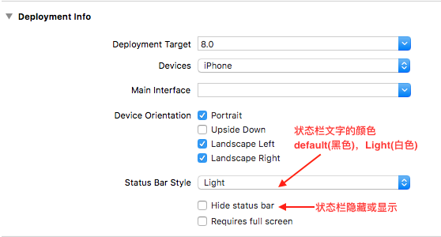
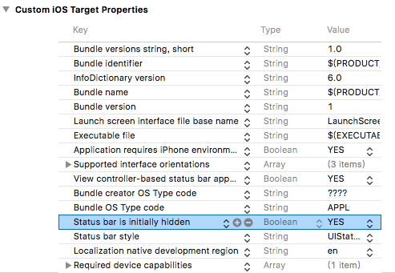

### 目录：
一、状态栏与导航栏
二、设置状态栏显隐与字体样式
三、设置状态栏背景色
四、启动页隐藏状态栏
五、状态栏、导航栏相关的常用宏定义

[相关文章：iOS导航栏的使用总结](https://www.jianshu.com/p/50cd38f2772c)

#### 一、状态栏与导航栏
状态栏：显示时间、电池等信息
导航栏：显示app页面标题，返回按钮等

iOS7之前：状态栏与导航栏是分开的；
iOS7之后：状态栏与导航栏合在一起；导航部分总高度(64)= 状态栏高度(20) +导航栏内容高度((44）

iPhoneX设备出现以后，状态栏的高度变为44，导航栏部分总高度(88) = 状态栏(44) + 导航栏内容高度(44)

#### 二、设置状态栏显隐与字体样式
iOS状态栏可以设置显示和隐藏，也可以设置文字的颜色。通过修改info.plist中的**View controller-based status bar appearance**属性为NO或者YES，状态栏的设置可区分为全局控制和局部控制。
全局控制：通过info.plist设置，或者调用全局方法。
分页控制：在视图控制器里通过prefersStatusBarHidden方法设置。

##### 1. 全局控制
默认情况或者手动设置View controller-based status bar appearance设置为NO，此时状态栏需要全局设置，而且有两种方法设置。

**方法1：**依次进入Targets】->【General】->【Deployment Info】，然后可进行进行设置如下:


**方法2：**代码设置

```
//1.设置状态栏隐藏(YES)或显示(NO)
[[UIApplication sharedApplication] setStatusBarHidden:NO];
   
//2.设置状态栏字体颜色
//UIStatusBarStyleDefault,黑色(默认)
//UIStatusBarStyleLightContent,白色
[[UIApplication sharedApplication] setStatusBarStyle:UIStatusBarStyleDefault];
```

注意：使用代码控制全局的状态栏，代码的位置很重要；在AppDelegate中写入可以设置整个App页面的状态栏样式；
如果需要单独设置其中一个页面隐藏状态栏，需要在进入页面时设置隐藏，退出页面时设置显示，以保证不影响其他页面的状态栏样式。

##### 2. 分页设置

在info.plist中设置View controller-based status bar appearance属性为YES，状态栏默认显示且字体黑色。此时全局设置的操作都是无效的，需要分页设置才能修改其样式，即：在每个视图控制器或者控制器基类中使用如下代码：

```
- (UIStatusBarStyle)preferredStatusBarStyle
{
    return UIStatusBarStyleLightContent; //返回白色
    //return UIStatusBarStyleDefault;    //返回黑色
}

- (BOOL)prefersStatusBarHidden {
    return YES;  //设置状态栏隐藏
    //return NO; //设置状态栏显示
}

```

但是，这里存在一个问题：如果当前视图控制器是UINavigationController的子视图控制器，preferredStatusBarStyle并不会被调用。这是因为导航控制器里的preferredStatusBarStyle才具有修改状态栏样式的能力，解决这个问题的方法有两种：
方法1：添加子类导航控制器
我们需要使用自定义的子类导航控制器，在其中添加如下的代码：

```
- (UIStatusBarStyle)preferredStatusBarStyle {
    UIViewController *topVC = self.topViewController;
    return [topVC preferredStatusBarStyle];
}
```

方法2：放弃preferredStatusBarStyle
我们可以不使用preferredStatusBarStyle方法，而且直接在当前视图控制器中调用如下方法修改状态栏。

```
//状态栏和导航栏背景色为白色，状态栏文字为黑色
self.navigationController.navigationBar.barStyle = UIBarStyleDefault;

//状态栏和导航栏背景色为黑色，状态栏文字为白色
self.navigationController.navigationBar.barStyle = UIBarStyleBlack;

```


#### 三、设置状态栏背景色
iOS7之后的状态栏和导航栏融合在一块，所以默认情况下，状态栏都是跟随导航栏背景色的变化而变化。所以我们可以通过改变导航栏来修改状态栏背景色：

```
//设置状态栏与到导航栏都是不透明
self.navigationController.navigationBar.translucent = NO;
//设置状态栏与到导航栏背景色都是橙色
[self.navigationController.navigationBar setBarTintColor:[UIColor orangeColor]];
```

当然，我们也可以单独设置状态栏的背景色，示例代码如下：

```
UIView *statusBar = [[[UIApplication sharedApplication] valueForKey:@"statusBarWindow”] 
    valueForKey:@"statusBar"];
if ([statusBar respondsToSelector:@selector(setBackgroundColor:)]) {
    statusBar.backgroundColor = [UIColor greenColor];
}
```
注意：如果是单独设置某个页面的状态栏背景色，还需要在离开页面时恢复原样。

#### 四、启动页隐藏状态栏


App启动页如果不需要显示状态栏信息，可以设置隐藏。设置方法依然是修改info.plist，只需要设置Status bar is initially hidden即可，将其设置为YES之后，启动页将暂时不显示状态栏，操作如下：



#### 五、状态栏、导航栏相关的常用宏定义

```
#pragma mark - 设备参数
//屏幕宽
#define ZS_ScreenWidth   [[UIScreen mainScreen] bounds].size.width

//屏幕高
#define ZS_ScreenHeight  [[UIScreen mainScreen] bounds].size.height

//判断设备类型是否iPhoneX
#define ZS_ISIphoneX    (ZS_ScreenWidth == 375.f && ZS_ScreenHeight == 812.f ? YES : NO)

//导航栏高度
#define ZS_NavBarHeight (ZS_ISIphoneX ? 88.f : 64.f)

//状态栏高度
#define ZS_StatusBarHeight (ZS_ISIphoneX ? 44.f : 20.f)

//导航栏内容高度
#define ZS_NavBarContentHeight 44.0

//标签栏高度
#define ZS_TabBarHeight (ZS_ISIphoneX ? 49.f + 34.f : 49.f)

```


[原文链接](https://www.jianshu.com/p/1dd3a2aec890)

