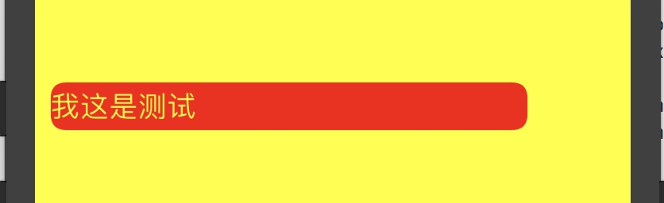
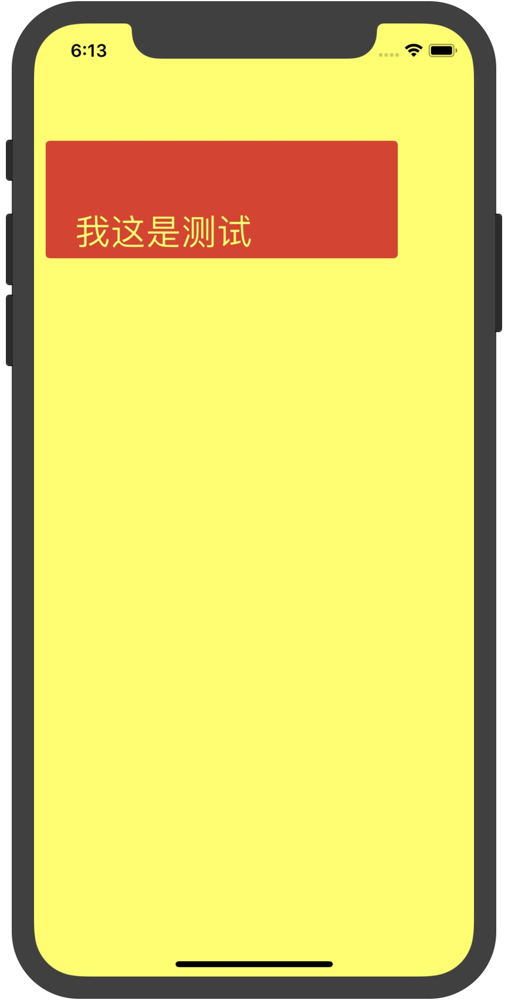

> UILabel是UIKit中提供的文本视图控件，用于在iOS设备上展示文本的基础控件，系统提供给我们开发者使用的UILabel本身已经具备了非常强大的功能，我这里所谓的自定义UIlabel实际上也是在原基础上做功能的增加，但是增加的过程中用到的方法，实际上还能有更多的使用。

参考资料

[UIBezierPath 二次曲线方程式, addQuadCurveToPoint:controlPoint: 如何通过 point.x 获取到 point.y](https://www.jianshu.com/p/785094a01327)

[IOS动画学习小记(1)-图形](https://www.jianshu.com/p/2ad0e265bc50)

[iOS开发 | 自定义不规则label](https://www.jianshu.com/p/fade8341c316)

### 基础概念

#### 在自定义之前首先了解两个方法

- `drawRect:`

    - 重绘作用：重写该方法以实现自定义的绘制内容
    - 详细可参考[这篇文章](https://www.jianshu.com/p/7242bc413ca8)

- `layoutSubviews`

    - 当我们自定义view的时候重写UIView的layoutSubviews如果程序需要对该控件所包含的子控件布局进行更精确的控制可通过重写该方法来实现。
    - 更详细的参见我的另一篇文章[《iOS layoutSubviews》]()

#### 再了解两个对象

- `CAShapeLayer`
    - `CAShapeLayer`属于`QuartzCore`框架，继承自`CALayer`。`CAShapeLayer`是在坐标系内绘制贝塞尔曲线的，通过绘制贝塞尔曲线，设置`shape`(形状)的`path`(路径)，从而绘制各种各样的图形以及不规则图形。因此，使用`CAShapeLayer`需要与`UIBezierPath`一起使用。

- `UIBezierPath`:[简单介绍](https://blog.csdn.net/yongyinmg/article/details/38844879)
    - `UIBezierPath`类允许你在自定义的 `View` 中绘制和渲染由直线和曲线组成的路径。你可以在初始化的时候直接为你的`UIBezierPath`指定一个几何图形。通俗点就是`UIBezierPath`用来指定绘制图形路径，而`CAShapeLayer`就是根据路径来绘图的。
        - `UIBezierPath`就类似于是一块画板了，以下这些方法就是用来在画板上画线的工具
        - `moveToPoint:`：设置初始线段的起点
        - `addLineToPoint:`：画一条线
        - `addCurveToPoint:`和`addQuadCurveToPoint:`：分别是绘制`三阶的贝塞尔曲线`和`二阶的贝塞尔曲线`
        - `addArcWithCenter:`：绘制一段圆弧，[详细查看](https://blog.csdn.net/Enjolras1024/article/details/51981966)
        - `closePath`:结束一个shape的subpath表述，它也在最后一个点和第一个点之间画一条线段，如果我们画多边形的话，这个一个便利的方法我们不需要去画最后一条线。
        
      ```
        - (void)moveToPoint:(CGPoint)point;
        - (void)addLineToPoint:(CGPoint)point;
        - (void)addCurveToPoint:(CGPoint)endPoint controlPoint1:(CGPoint)controlPoint1 controlPoint2:(CGPoint)controlPoint2;
        - (void)addQuadCurveToPoint:(CGPoint)endPoint controlPoint:(CGPoint)controlPoint;
        - (void)addArcWithCenter:(CGPoint)center radius:(CGFloat)radius startAngle:(CGFloat)startAngle endAngle:(CGFloat)endAngle clockwise:(BOOL)clockwise NS_AVAILABLE_IOS(4_0);
        - (void)closePath;
      ```

#### 最后在看看两个系统分类的定义

- 这几个方法能将字符串绘制到layer上，自定义的Label的`drawRect:`中使用这些方法，就能将文字绘制上去了。
- 当然如果我们自己实现了这个`drawRect:`方法，系统就不会自动将文字覆盖上去了。
- [详细请看](https://www.jianshu.com/p/4dd86df5c8ec)

```
@interface NSString(NSStringDrawing)
- (CGSize)sizeWithAttributes:(nullable NSDictionary<NSAttributedStringKey, id> *)attrs NS_AVAILABLE(10_0, 7_0);
- (void)drawAtPoint:(CGPoint)point withAttributes:(nullable NSDictionary<NSAttributedStringKey, id> *)attrs NS_AVAILABLE(10_0, 7_0);
- (void)drawInRect:(CGRect)rect withAttributes:(nullable NSDictionary<NSAttributedStringKey, id> *)attrs NS_AVAILABLE(10_0, 7_0);
@end

@interface NSAttributedString(NSStringDrawing)
- (CGSize)size NS_AVAILABLE(10_0, 6_0);
- (void)drawAtPoint:(CGPoint)point NS_AVAILABLE(10_0, 6_0);
- (void)drawInRect:(CGRect)rect NS_AVAILABLE(10_0, 6_0);
@end
```
在了解这几个定义后就可以开始自定义了

### 前奏
- 首先创建一个继承于UILabel的子类（我这里叫做HTLabel）

### 自定义高性能的圆角

> 这里虽说是圆角，但是从代码中还是能分析出，我们这实际上是能自定义不规则的图形的，哈哈哈

- 首先再类的内部扩展定义两个属性（这两个属性只在自己内部使用，定义私有的属性就行）
    
    ```objc
    @interface HTLabel ()
    @property (nonatomic,strong) CAShapeLayer * maskLayer;
    @property (nonatomic,strong) UIBezierPath * path;
    @end
    ```
- 再在.h文件中申明

    ```
    typedef NS_OPTIONS(NSUInteger, HTLabeltCornerType) {
        HTLabeltCornerTopLeft     = 1 << 0,
        HTLabeltCornerTopRight    = 1 << 1,
        HTLabeltCornerBottomLeft  = 1 << 2,
        HTLabeltCornerBottomRight = 1 << 3,
        HTLabeltCornerAllCorners  = HTLabeltCornerTopLeft|HTLabeltCornerTopRight|HTLabeltCornerBottomLeft|HTLabeltCornerBottomRight
    };
    ```

    ```
    @interface HTLabel : UILabel

    /// 设置哪个方向需要切圆角
    @property (nonatomic,assign) HTLabeltCornerType roundingCornerType;
        
    /// 切的圆角的大小
    @property (nonatomic,assign) CGFloat cornerRadius;

    @end
    ```


- 再在初始化方法中实例化
  
  ```
    - (instancetype)initWithFrame:(CGRect)frame
    {
        self = [super initWithFrame:frame];
        if (self) {
            _maskLayer = [CAShapeLayer layer];
            [self.layer setMask:_maskLayer];
            _path = [UIBezierPath bezierPath];
            
            _roundingCornerType = HTLabeltCornerAllCorners;
            _cornerRadius = 0;
        }
        return self;
    }
  ```
- 接着就是实现`-(void)layoutSubviews`了,在这里可以看出，图像的外观是可以自定义的，可以定义成任何不规则的图形

    ```
    -(void)layoutSubviews
    {
        self.maskLayer.frame = self.bounds;
        
        if (self.cornerRadius<0) self.cornerRadius = 0;
        
        [self.path removeAllPoints];
        
        CGSize size = self.bounds.size;
        
        CGPoint controlPoint_1 = CGPointMake(size.width, 0);
        CGPoint controlPoint_2 = CGPointMake(size.width, size.height);
        CGPoint controlPoint_3 = CGPointMake(0, size.height);
        CGPoint controlPoint_4 = CGPointMake(0, 0);
    
        
        CGPoint startPoint = CGPointMake(self.cornerRadius, 0);
        CGPoint point_1 = CGPointMake(size.width-self.cornerRadius, 0);
        CGPoint point_2 = CGPointMake(size.width, self.cornerRadius);
        CGPoint point_3 = CGPointMake(size.width, size.height-self.cornerRadius);
        CGPoint point_4 = CGPointMake(size.width-self.cornerRadius, size.height);
        CGPoint point_5 = CGPointMake(self.cornerRadius, size.height);
        CGPoint point_6 = CGPointMake(0, size.height-self.cornerRadius);
        CGPoint endPoint = CGPointMake(0, self.cornerRadius);
        
        [self.path moveToPoint:startPoint];
        [self.path addLineToPoint:point_1];
        if (self.roundingCornerType & HTLabeltCornerTopRight) {
            [self.path addQuadCurveToPoint:point_2 controlPoint:controlPoint_1];//右上圆角
        }else{
            [self.path addLineToPoint:controlPoint_1];
            [self.path addLineToPoint:point_2];
        }
        [self.path addLineToPoint:point_3];
        if (self.roundingCornerType & HTLabeltCornerBottomRight) {
            [self.path addQuadCurveToPoint:point_4 controlPoint:controlPoint_2];//右下圆角
        }else{
            [self.path addLineToPoint:controlPoint_2];
            [self.path addLineToPoint:point_4];
        }
        [self.path addLineToPoint:point_5];
        if (self.roundingCornerType & HTLabeltCornerBottomLeft) {
            [self.path addQuadCurveToPoint:point_6 controlPoint:controlPoint_3];//左下圆角
        }else{
            [self.path addLineToPoint:controlPoint_3];
            [self.path addLineToPoint:point_6];
        }
        [self.path addLineToPoint:endPoint];
        if (self.roundingCornerType & HTLabeltCornerTopLeft) {
            [self.path addQuadCurveToPoint:startPoint controlPoint:controlPoint_4];//左上圆角
        }else{
            [self.path addLineToPoint:controlPoint_4];
            [self.path addLineToPoint:startPoint];
        }
        [self.path closePath];
        self.maskLayer.path = self.path.CGPath;
    }
    ```

- 这部分功能就算是实现了，将HTLabel实例化看看效果
    
    ```
    
    HTLabel *label = [[HTLabel alloc]initWithFrame:CGRectMake(10, 100, 300, 30)];
    label.text = @"我这是测试";
    
    label.font = [UIFont systemFontOfSize:18];
    label.textColor = [UIColor yellowColor];
    label.backgroundColor = [UIColor redColor];
    
    label.cornerRadius = 10;
    label.roundingCornerType = HTRoundingCornerTypeAllCorners;
    
    [self.view addSubview:label];
    
    ```

    

- 到这里高性能的圆角制作完成了。
- 但是我用label的过程中还有一个很无奈的要求，就是label内部的文字要能设置那边距，但是label本身是没有这个属性的，但是如果用富文本感觉太过麻烦。这样我们重写`drawRect:`方法，在这里我们内部自己去渲染文字的排列，也就能实现内边距的功能了。

### 自定义Label
- 根据我自己的需求，实际上有两个需要我去实现
    1. label需要能实现设置内边距的功能
    2. label中的文字能实现于UIButton能将内容设置成上对齐，居中对齐，居下对齐
    3. 由于重写了drawRect:方法，系统提供的adjustsFontSizeToFitWidth自动缩放字体大小的功能将会失效，我这里需要重新实现这个功能。
- 确定好需求后，开始实现功能

- 首先 在.h 文件中定义好需要的变量，这里直接使用上面的HTLabel，直接加上属性就行

    ```objc
    
    typedef NS_ENUM(NSInteger, HTTextHorizontalAlignment) {
        HTTextHorizontalAlignmentTop        = 0,    // Visually left aligned
        HTTextHorizontalAlignmentCenter     = 1,    // Visually centered
        HTTextHorizontalAlignmentBottom     = 2,    // Visually right aligned
    };

    
    
    /**
     如果adjustsFontSizeToFitWidth == yes，内部会根据自身的bounds和titleEdgeInsets 计算出刚好合适的字体的字号，minFontSize 则为计算时最小的字号
     默认为：0。
     建议不要修改这个属性，使用默认的0就好。
     */
    @property(nonatomic) CGFloat minFontSize;
    
    /**
     默认：HTTextHorizontalAlignmentCenter
     */
    @property(nonatomic) HTTextHorizontalAlignment contentHorizontalAlignment;
    ```

- 重新构建初始化方法
  
  ```
    - (instancetype)initWithFrame:(CGRect)frame
    {
        self = [super initWithFrame:frame];
        if (self) {
            _maskLayer = [CAShapeLayer layer];
            [self.layer setMask:_maskLayer];
            _path = [UIBezierPath bezierPath];
            _roundingCornerType = HTLabeltCornerAllCorners;
            _cornerRadius = 0;
            _titleEdgeInsets = UIEdgeInsetsZero;
            _minFontSize = 0;
            _contentHorizontalAlignment = HTTextHorizontalAlignmentCenter;
        }
        return self;
    }
  ```
  
  - 然后重写新定义的属性的setter方法，因为我们需要改变这些属性就能调用`drawRect:`进行重绘。
    
    ```objc
    -(void)setRoundingCornerType:(HTLabeltCornerType)roundingCornerType
    {
        _roundingCornerType = roundingCornerType;
        [self setNeedsLayout];
    }
    
    -(void)setCornerRadius:(CGFloat)cornerRadius
    {
        _cornerRadius = cornerRadius;
        [self setNeedsLayout];
    }
    
    /// 重写adjustsFontSizeToFitWidth的setter方法，因为重写drawRect:的原因，导致了设置adjustsFontSizeToFitWidth不会进行重绘，但是我们需要重绘
    - (void)setAdjustsFontSizeToFitWidth:(BOOL)adjustsFontSizeToFitWidth
    {
        [super setAdjustsFontSizeToFitWidth:adjustsFontSizeToFitWidth];
        [self setNeedsDisplay];
    }
    ```

- 实现`drawRect:`方法

```
- (void)drawRect:(CGRect)rect {
    // Drawing code

    UIFont *font = self.font;

    NSMutableAttributedString *attributedText = [[NSMutableAttributedString alloc]initWithAttributedString:self.attributedText];
    //label本身的尺寸
    CGRect bounds = self.bounds;

    //获取label减去内边距剩余的空间
    CGFloat contentW = bounds.size.width - self.titleEdgeInsets.left - self.titleEdgeInsets.right;
    CGFloat contentH = bounds.size.height - self.titleEdgeInsets.top - self.titleEdgeInsets.bottom;
    CGRect contentBounds = CGRectMake(0,
                                      0,
                                      contentW,
                                      contentH);
    
    CGSize currentTextSize = [self ht_sizeOfString:self.text Font:font limitWidth:contentW];
    CGSize nextTextSize = [self ht_sizeOfString:self.text Font:[font fontWithSize:font.pointSize+0.5] limitWidth:contentW];
    
    
    if (self.adjustsFontSizeToFitWidth == YES) {
        
        BOOL isContain = [self ht_contrastSize:currentTextSize destinationSize:contentBounds.size];
        BOOL isNextContain = [self ht_contrastSize:nextTextSize destinationSize:contentBounds.size];
        
        if (isContain && isNextContain) {
            //字体还能增大,且重新计算currentTextSize
            UIFont *newFont = [self ht_contrastAscendingByFont:font destinationSize:contentBounds.size];
            font = newFont;
            currentTextSize = [self ht_sizeOfString:self.text Font:font limitWidth:contentW];
        }else if (!isContain){
            //字体需要缩小,且重新计算currentTextSize  这里也意味着isNextContain==NO
            UIFont *newFont = [self ht_contrastDescendingByFont:font destinationSize:contentBounds.size];
            font = newFont;
            currentTextSize = [self ht_sizeOfString:self.text Font:font limitWidth:contentW];
        }else if (isContain && !isNextContain){
            //意味着字体大小刚刚好，不需要操作
        }
        [attributedText removeAttribute:NSFontAttributeName range:NSMakeRange(0, self.attributedText.length)];
        [attributedText addAttribute:NSFontAttributeName value:font range:NSMakeRange(0, self.attributedText.length)];
    }
    
    CGFloat textRectX = 0 + self.titleEdgeInsets.left;
    CGFloat textRectY = 0 + self.titleEdgeInsets.top;
    CGFloat textRectW = currentTextSize.width;
    CGFloat textRectH = currentTextSize.height;
    
    switch (_contentHorizontalAlignment) {
        case HTTextHorizontalAlignmentTop:
            textRectY = 0 + self.titleEdgeInsets.top;
            break;
        case HTTextHorizontalAlignmentCenter:
            textRectY = bounds.size.height/2.0 - textRectH/2.0;
            break;
        case HTTextHorizontalAlignmentBottom:
            textRectY = bounds.size.height - self.titleEdgeInsets.bottom - textRectH;
            break;
        default:
            textRectY = 0 + self.titleEdgeInsets.top;
            break;
    }

    CGRect textRect = CGRectMake(textRectX, textRectY, textRectW, textRectH);

    /// NSParagraphStyleAttributeName 这个属性影响换行，实际上没什么作用
    [attributedText removeAttribute:NSParagraphStyleAttributeName range:NSMakeRange(0, attributedText.length)];
    [attributedText drawInRect:textRect];
}

/**
 升序查找 大小合适的字体
 
 @param font 原始字体
 @param desSize 目标尺寸
 @return 返回刚好符合目标尺寸的字体
 */
- (UIFont *)ht_contrastAscendingByFont:(UIFont *)font destinationSize:(CGSize)desSize
{
    CGFloat fontSize = _minFontSize;

    for (CGFloat size = fontSize; size < 80; ) {
        UIFont *newFont = [font fontWithSize:size];
        CGSize newTextSize = [self ht_sizeOfString:self.text Font:newFont limitWidth:desSize.width];
        
        UIFont *lastFont = [font fontWithSize:size+0.5];
        CGSize lastTextSize = [self ht_sizeOfString:self.text Font:lastFont limitWidth:desSize.width];
        
        BOOL isContain = [self ht_contrastSize:newTextSize destinationSize:desSize];
        BOOL isLastContain = [self ht_contrastSize:lastTextSize destinationSize:desSize];

        if (isContain && !isLastContain) {
            return newFont;
        }
        size = size + 0.5;
    }
    return [font fontWithSize:80];
}


/**
 降序查找 大小合适的字体

 @param font 原始字体
 @param desSize 目标尺寸
 @return 返回刚好符合目标尺寸的字体
 */
- (UIFont *)ht_contrastDescendingByFont:(UIFont *)font destinationSize:(CGSize)desSize
{
    CGFloat fontSize = font.pointSize;
    for (CGFloat size = fontSize; size>0; ) {
        if (fontSize<=_minFontSize) {
            return [font fontWithSize:_minFontSize];
        }
        UIFont *newFont = [font fontWithSize:size];
        CGSize newTextSize = [self ht_sizeOfString:self.text Font:newFont limitWidth:desSize.width];
        BOOL isContain = [self ht_contrastSize:newTextSize destinationSize:desSize];
        if (isContain) {
            return newFont;
        }
        size = size - 0.5;
    }
    return [font fontWithSize:_minFontSize];
}


/**
 对比rect是否完全被包含在desRect中，如果是则返回YES，否则返回NO

 @param size 需要对比的size
 @param desSize 被对比的desSize
 */
- (BOOL)ht_contrastSize:(CGSize)size destinationSize:(CGSize)desSize
{
    if (size.width<=desSize.width && size.height<=desSize.height) {
        return YES;
    }else
    {
        return NO;
    }
}


-(CGSize)ht_sizeOfString:(NSString *)string Font:(UIFont *)font limitWidth:(CGFloat)width
{
    if (width<=0) {
        width = [UIScreen mainScreen].bounds.size.width;
    }
    CGRect bounds;
    NSDictionary * parameterDict=[NSDictionary dictionaryWithObject:font forKey:NSFontAttributeName];
    bounds=[string boundingRectWithSize:CGSizeMake(width, CGFLOAT_MAX) options:NSStringDrawingTruncatesLastVisibleLine|NSStringDrawingUsesFontLeading|NSStringDrawingUsesLineFragmentOrigin attributes:parameterDict context:nil];
    return bounds.size;
}
```

- 最后功能算是实现了，将HTLabel实例化看看效果

```
HTLabel *label = [[HTLabel alloc]initWithFrame:CGRectMake(10, 100, 300, 100)];
label.text = @"我这是测试";
label.font = [UIFont systemFontOfSize:30];
label.textColor = [UIColor yellowColor];
label.backgroundColor = [UIColor redColor];
label.contentHorizontalAlignment = HTTextHorizontalAlignmentBottom;
    
label.cornerRadius = 4;
label.roundingCornerType = HTRoundingCornerTypeAllCorners;
label.titleEdgeInsets = UIEdgeInsetsMake(5, 25, 5, 5);
[self.view addSubview:label];
```




[Demo地址](https://github.com/KingXcode/HTLabel)

