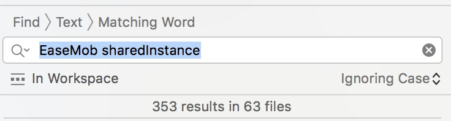
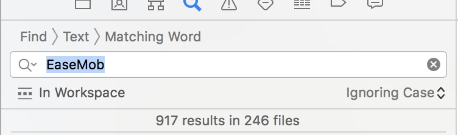

> 现在在公司管理着3个项目，目测年底公司还会有个新的项目需要架构。ps. 我们公司不是外包公司，软件都是归公司所有。
> 因为公司项目需求，需要将公司项目原有的项目中使用的环信SDK移除，使用网易云信来实现基础的IM功能，感觉自己要爆炸了，手上的需求按照正常的进度都需要三个多月才可能做完，现在又插进这个需求也是醉了，现在将移除环信和植入网易云信的过程记录下来，以供下一个项目植入网易云信的时候有个参考。


我们公司的一个项目名称叫做《珠宝易》，有兴趣的可以上Appstore下载看看。

首先，这个项目开始之初，植入环信的工程师是选择的手动集成，他之前把文件也是随意丢进的项目，感觉找起来都麻烦，这次我选择使用cocopod集成，方便快捷。呵呵呵。

#### 注意
- 导入的时候注意下面两个任选其一就行，两个同时倒入会报错哦～～

    ```
    /// NIMSDK不带UI库，NIMKit带UI库
    pod 'NIMSDK', '~> 5.5.0'
    pod 'NIMKit'
    ```
- `NIMKit`会依赖`SDWebImage`、`TZImagePickerController`等几个第三方框架，导入的时候注意不要冲突哦～ps.公司这个项目是四年前启动的很多库都是好几年前的版本了，比如`SDWebImage`项目中是用的这个库的老版本，调用的方法都是旧的，比图缓存的处理啊，图片的下载啊，使用的类都不一样了，改的时候需要注意。

> 初期需求评审时，我的计划是同时更换掉环信的UI库，使用云信的UI库。后来仔细估算了下工作量，得出的结论是，早期先只更换SDk，等SDK更换完成然后进行UI库的替换。毕竟有太多的自定义cell需要重新写了。

# 环信SDK解耦
- 解耦之前我在项目中搜索了一下`EaseMob sharedInstance`，发现一件头皮发麻的事。
    
- 搜索`EaseMob`
    

我这个项目中对环信的耦合程度太高了，我考虑了下，之后替换环信api的时候不会无厘头的去修改，先将项目中的代码解耦，然后替换。

### 1.先将整个项目中调用环信的api进行分档归类，这是个苦活，因为耦合度太高，需要归类的文件太多，没办法，慢慢搞起。

### 2.使用统一的工具类进行SDK的方法调用

### 3.建立对象的对应关系

### 3.1 环信和云信对IM的定义

- 聊天类型分三种 单聊、群聊、聊天室。我这里只用到单聊和群聊。
  他们的聊天type虽然定义的枚举名称不一样，但是都是int类型 - 0:表示单聊；1表示群聊
    
- 环信中对会话消息的处理，群消息的处理，好友关系的处理都是依赖的chatManager这个属性
    - `chatManager`：聊天管理器, 获取该对象后, 可以做登录、聊天、加好友等操作
    - `deviceManager`：设备管理器, 获取该对象后, 可以操作硬件相关的接口(照片、音频、地理位置信息等)
- 云信则不一样
    - `loginManager`：登录管理类 负责登录,注销和相关操作的通知收发
    - `chatManager`：聊天管理类,负责消息的收发
    - `conversationManager`：会话管理类,负责消息,最近会话的读写和管理
    - `mediaManager`：媒体管理类,负责多媒体相关的接口 (录音等)
    - `teamManager`：群组管理类,负责群组的操作:创建,拉人,踢人,同步等
    - `userManager`：好友管理类
    - `systemNotificationManager`：系统通知管理类
    - `apnsManager`：APNS推送管理类
    - `chatroomManager`：聊天室管理类
    - `broadcastManager`：广播消息管理类
    - `redPacketManager`：红包管理类
    
### 3.2 对象的对应关系

| 环信对象 | 网易云信对象 |
| :-: | :-: |
| EMConversation(聊天的会话对象) | NIMSession(会话对象) |
| EMMessage(聊天消息类) | NIMMessage(消息结构) |
| EMChatText(聊天的文本对象类型) | 无 |
| EMTextMessageBody | NIMMessageObject |
| EMChatImage | 无 |
| EMImageMessageBody | NIMImageObject（作为NIMMessage的messageObject） |
| EMGroup | NIMTeam |
| EMError | NSError |
| EMCDDeviceManager（距离监听） |  |


| 环信 | 云信 |
| :-: | :-: |
| EMAttachmentDownloadStatus | NIMMessageAttachmentDownloadState |
| 附件下载的状态 | 消息附件下载状态 |

云信的消息对象`NIMMessage`，文本消息设置它的text属性，其他的消息类型都是以消息附件的形式发送的，即`NIMMessage`的`messageObject`属性。                      

`EMCDDeviceManager`：用于设备监听，实现代理方法`proximitySensorChanged:`当手机靠近耳朵时或者离开耳朵时的回调方法`isCloseToUser YES为靠近了用户, NO为远离了用户`

```
[[EaseMob sharedInstance].chatManager pushNotificationOptions]

[[NIMSDK sharedSDK].apnsManager currentSetting]

这两行返回的是推送相关的设置
```

> 注意环信的消息撤回和云信的消息撤回不一致`ChatViewController`中的`revokeMenuAction:`实现消息撤回，注意逻辑的变更


### 3.3 `EMChatManagerDelegate`与`NIMChatManagerDelegate`的对应关系

```
EMChatManagerDelegate:
接受群组邀请并加入群组后的回调
- (void)didAcceptInvitationFromGroup:(EMGroup *)group error:(EMError *)error;

NIMChatManagerDelegate:对应的回调


```


### 4.进行对应对象的替换

### 5.对统一工具类中每一个方法进行全局搜索，一个一个的验证相关接口调用是否异常


