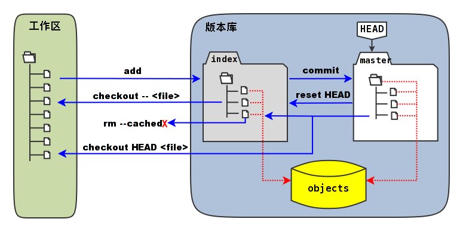
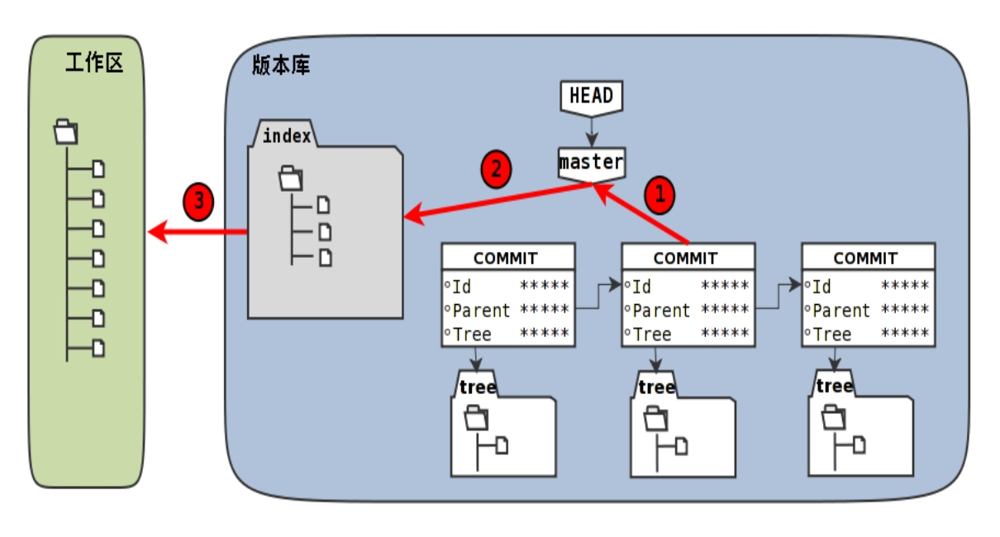
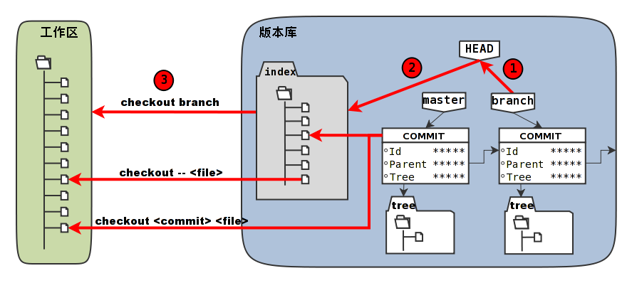

[Git权威指南](http://www.worldhello.net/gotgit/index.html)
# Git初始化

## 创建版本库以及第一次提交

本章主要学习：`git init`、`git add`和`git commit`

```
git --version //获取git当前版本
```
设置Git的环境变量，这是一次性的设置。即这些设置会在全局文件（用户主目录下的`.gitconfig`）或系统文件（`/etc/gitconfig`）中做永久的记录。

- 告诉Git当前用户的姓名和邮件地址，配置的用户名和邮件地址将在版本库提交时作为提交者的用户名和邮件地址。

    注意下面的两条命令不要照抄照搬，而是用您自己的用户名和邮件地址代替这里的用户名和邮件地址，否则您的劳动成果（提交内容）可要算到作者的头上了。
    
    ```
    $ git config --global user.name "Jiang Xin"
    $ git config --global user.email jiangxin@ossxp.com
    ```
    执行下面的命令，删除Git全局配置文件中关于user.name和user.email的设置：
    
    ```
    $ git config --unset --global user.name
    $ git config --unset --global user.email
    ```
    
- 设置一些Git别名，以便可以使用更为简洁的子命令。
    
    - 如果拥有系统管理员权限（可以执行sudo命令），希望注册的命令别名能够被所有用户使用，可以执行如下命令：

        ```
        $ sudo git config --system alias.br branch
        $ sudo git config --system alias.ci "commit -s"
        $ sudo git config --system alias.co checkout
        $ sudo git config --system alias.st "-p status"
        ```
    - 也可以运行下面的命令，只在本用户的全局配置中添加Git命令别名：
    
        ```
        $ git config --global alias.st status
        $ git config --global alias.ci "commit -s"
        $ git config --global alias.co checkout
        $ git config --global alias.br branch
        ```

1. 终端中输入：`git init` 会在当前目录下初始化git仓库，即：创建了隐藏目录`/{path}/.git`。
`.git`版本库目录所在的目录,称为工作区。

2. 假如在这个目录创建文件`hello.txt`，那么现在在git的工作区出现了这个文件，但是文件还没有添加进入工作区。终端中输入：`git add hello.txt`将这个文件进行标记（后面会提到，即：放入暂存区），继续输入`git commit -m "说明描述"`，将文件添加进本地的版本库中。
    - `git add hello.txt`这个只是标记一个文件如果文件非常多如果这样一个一个的添加未免有些麻烦，可以使用`git add .`来进行批量操作。

## Git暂存区
当我们在工作去修改了文件之后，我们是不能直接将工作区的文件直接提交到本地的版本库中的，在git中有一个被称之为暂存区的文件，这相当于是工作区与本地版本库中的中间状态（这里称之为状态其实也不合适，但是我也找不到用什么词好）。当我们在工作区的文件进行了修改之后，将修改的文件`add`进暂存区，然后执行`commit`，这样就会将工作区的变动存入版本库中。

1. 工作区中修改了文件`object.h`
    - 执行`git status -s`精简的状态输出

    ```
    $ git status -s
     M object.h
    ```
    
2. 执行命令`git add object.h`，到这一步修改的文件只被提交到在暂存区。
    - 这时执行`git diff`会发现没有输出，因为这是对比的暂存区和版本库中文件的差异。
    - 执行`git diff HEAD`，将当前工作区和HEAD（当前版本库的头指针）进行比较，会发现有差异。这个差异才是正常的，因为尚未真正提交么。
    - 执行`git status -s`精简的状态输出与执行git add之前的精简状态输出相比，有细微的差别

    ```
    $ git status -s
    M  object.h
    ```
    
    ```
    1. 虽然都是 M（Modified）标识，但是位置不一样。在执行git add命令之前，这个M位于第二列（第一列是一个空格），在执行完git add之后，字符M位于第一列（第二列是空白）。 
    2. 位于第一列的字符M的含义是：版本库中的文件和处于中间状态——提交任务（提交暂存区，即stage）中的文件相比有改动。
    3. 位于第二列的字符M的含义是：工作区当前的文件和处于中间状态——提交任务（提交暂存区，即stage）中的文件相比也有改动。
    ```

3. 此时继续修改本地文件`object.h`
    - 执行`git status -s`精简的状态输出，下面表示：不但版本库中最新提交的文件和处于中间状态 —— 提交任务（提交暂存区, stage）中的文件相比有改动，而且工作区当前的文件和处于中间状态 —— 提交任务（提交暂存区, stage）中的文件相比也有改动。
    
    ```
    $ git status -s
    MM welcome.txt
    ```
    
    - 不带任何选项和参数调用`git diff`显示工作区最新改动，即工作区和提交任务（提交暂存区，stage）中相比的差异。
    - 将工作区和HEAD（当前工作分支）相比（`git diff HEAD`），会看到更多的差异。
    - 通过参数`--cached`或者`--staged`参数调用`git diff`命令，看到的是提交暂存区（提交任务，stage）和版本库中文件的差异。

4. 现在执行`git commit -m "备注"`
    - 执行`git status -s`精简的状态输出。此时第一列的M没有了，表示暂存区-版本库之间的变动没有了，因为暂存区中的内容被提交到了版本库。但是第二个M还在，表示工作区的内容和暂存区之间还存在差异，需要将工作区的改动add进入暂存区。
    
    ```
    $ git status -s
     M welcome.txt
    ```



 > 在这个图中，可以看到部分Git命令是如何影响工作区和暂存区（stage，亦称index）的。下面就对这些命令进行简要的说明，而要彻底揭开这些命令的面纱要在接下来的几个章节。

> - 图中左侧为工作区，右侧为版本库。在版本库中标记为index的区域是暂存区（stage，亦称index），标记为master的是master分支所代表的目录树。
> - 图中可以看出此时HEAD实际是指向master分支的一个“游标”。所以图示的命令中出现HEAD的地方可以用master来替换。
> - 图中的objects标识的区域为Git的对象库，实际位于.git/objects目录下，会在后面的章节重点介绍。
> - 当对工作区修改（或新增）的文件执行git add命令时，暂存区的目录树被更新，同时工作区修改（或新增）的文件内容被写入到对象库中的一个新的对象中，而该对象的ID被记录在暂存区的文件索引中。
> - 当执行提交操作（git commit）时，暂存区的目录树写到版本库（对象库）中，master分支会做相应的更新。即master最新指向的目录树就是提交时原暂存区的目录树。
> - 当执行git reset HEAD命令时，暂存区的目录树会被重写，被master分支指向的目录树所替换，但是工作区不受影响。
> - 当执行git rm –cached <file>命令时，会直接从暂存区删除文件，工作区则不做出改变。
> - 当执行git checkout .或者git checkout – <file>命令时，会用暂存区全部或指定的文件替换工作区的文件。这个操作很危险，会清除工作区中未添加到暂存区的改动。
> - 当执行git checkout HEAD .或者git checkout HEAD <file>命令时，会用HEAD指向的master分支中的全部或者部分文件替换暂存区和以及工作区中的文件。这个命令也是极具危险性的，因为不但会清除工作区中未提交的改动，也会清除暂存区中未提交的改动。


## Git重置

重置命令（`git reset`）是Git最常用的命令之一，也是最危险，最容易误用的命令。来看看`git reset`命令的用法。

```
用法一： git reset [-q] [<commit>] [--] <paths>...
用法二： git reset [--soft | --mixed | --hard | --merge | --keep] [-q] [<commit>]
```

`HEAD^`代表HEAD的父提交

```objc
$ git reset --hard HEAD^
```
这条命令就相当于将master重置到上一个老的提交上


1. 终端中执行`touch new-commit.txt`命令，会在工作区创建一个名为`new-commit`的文件
2. 此时，工作区将会保存之前存在的文件和刚才创建的文件。继续执行`git reset --hard HEAD^`。由于之前创建的文件没有保存到仓库中，所以执行这条命令后HEAd所指向的master分支会重置到前一次提交并且工作区的文件也一起被重置了。

Ps. 实际上使用这个命令的时候，有的时候文件的内容是会回到前一个版本，但是新增的文件不会删除，但是还有的时候新增的文件也会删除。我也不知道为什么，还请知道的大神指点一波，还是说是我自己弄错了？。。。哈哈哈哈




命令格式: `git reset [–soft | –mixed | –hard ] [<commit>]`

- 使用参数`--hard`，如：`git reset –hard <commit>`和`git reset --hard HEAD^`。
    - 会执行上图中的1、2、3全部的三个动作。
        1. 替换引用的指向。引用指向新的提交ID。
        2. 替换暂存区。替换后，暂存区的内容和引用指向的目录树一致。
        3. 替换工作区。替换后，工作区的内容变得和暂存区一致，也和HEAD所指向的目录树内容相同。

- 使用参数`--soft`，如:`git reset –soft <commit>`
    - 会执行上图中的操作1。即只更改引用的指向，不改变暂存区和工作区。
    
- 使用参数`--mixed`或者不使用参数（缺省即为`--mixed`），如:`git reset <commit>`
    - 会执行上图中的操作1和操作2。即更改引用的指向以及重置暂存区，但是不改变工作区。

---


- 命令：`git reset`
- 命令：`git reset HEAD`
    - 仅用HEAD指向的目录树重置暂存区，工作区不会受到影响，相当于将之前用git add命令更新到暂存区的内容撤出暂存区。引用也未改变，因为引用重置到HEAD相当于没有重置。

- 命令：`git reset – filename`
- 命令：`git reset HEAD filename`
    - 仅将文件filename撤出暂存区，暂存区中其他文件不改变。相当于对命令git add filename的反向操作。

- 命令：`git reset –soft HEAD^`
    - 工作区和暂存区不改变，但是引用向前回退一次。当对最新提交的提交说明或者提交的更改不满意时，撤销最新的提交以便重新提交。
    - 在之前曾经介绍过一个修补提交命令`git commit –amend`，用于对最新的提交进行重新提交以修补错误的提交说明或者错误的提交文件。修补提交命令实际上相当于执行了下面两条命令。（注：文件.git/COMMIT_EDITMSG保存了上次的提交日志）
    
- 命令：`git reset HEAD^`
- 命令：`git reset –mixed HEAD^`
    - 工作区不改变，但是暂存区会回退到上一次提交之前，引用也会回退一次。

- 命令：`git reset –hard HEAD^`
    - 彻底撤销最近的提交。引用回退到前一次，而且工作区和暂存区都会回退到上一次提交的状态。自上一次以来的提交全部丢失。
    
---


## Git检出

> 重置命令(reset)一般用于重置暂存区（除非使用`--hard`参数，否则不重置工作区）

> 检出命令(checkout)主要是覆盖工作区（如果`<commit>`不省略，也会替换暂存区中相应的文件)

检出命令（git checkout）是Git最常用的命令之一，同样也很危险，因为这条命令会重写工作区。

```objc
用法一： git checkout [-q] [<commit>] [--] <paths>...
用法二： git checkout [<branch>]
用法三： git checkout [-m] [[-b|--orphan] <new_branch>] [<start_point>]
```

用法一的<commit>是可选项，如果省略则相当于从暂存区（index）进行检出。

- 第一种用法（包含了路径<paths>的用法）不会改变HEAD头指针，主要是用于指定版本的文件覆盖工作区中对应的文件。如果省略<commit>，会拿暂存区的文件覆盖工作区的文件，否则用指定提交中的文件覆盖暂存区和工作区中对应的文件。
- 第二种用法（不使用路径<paths>的用法）则会改变HEAD头指针。之所以后面的参数写作<branch>，是因为只有HEAD切换到一个分支才可以对提交进行跟踪，否则仍然会进入“分离头指针”的状态。在“分离头指针”状态下的提交不能被引用关联到而可能会丢失。所以用法二最主要的作用就是切换到分支。如果省略<branch>则相当于对工作区进行状态检查。
- 第三种用法主要是创建和切换到新的分支（<new_branch>），新的分支从<start_point>指定的提交开始创建。新分支和我们熟悉的master分支没有什么实质的不同，都是在refs/heads命名空间下的引用。


- 命令：`git checkout branch`

    检出branch分支。要完成如图的三个步骤，更新HEAD以指向branch分支，以branch指向的树更新暂存区和工作区。
    
- 命令：`git checkout`
- 命令：`git checkout HEAD`
 
    汇总显示工作区、暂存区与HEAD的差异。
    
- 命令：`git checkout – filename`

    用暂存区中`filename`文件来覆盖工作区中的`filename`文件。相当于取消自上次执行`git add filename`以来（如果执行过）本地的修改。

- 命令：`git checkout branch – filename`

    维持`HEAD`的指向不变。将`branch`所指向的提交中的`filename`替换暂存区和工作区中相应的文件。注意会将暂存区和工作区中的`filename`文件直接覆盖。

- 命令：`git checkout – .` 或写做 `git checkout .`

    注意：`git checkout`命令后的参数为一个点（“.”）。这条命令最危险！会取消所有本地的修改（相对于暂存区）。相当于将暂存区的所有文件直接覆盖本地文件，不给用户任何确认的机会！


## Git恢复进度


