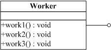

#### 2018.7.27

#  第一章 代码无错就是优？--- 简单工厂模式

- 规范    
    - 命名规范
    - 思路，结构清晰 
    - 思考全面
- 面向对象编程
    - 做到容易维护，容易扩展，容易复用
    - 不要用计算机的思考方式来思考程序
    - 通过封装，继承，多态降低程序的耦合度
    - 记住一点：高聚合，低耦合
    - 做到业务分离
- **简单工厂模式：**简单工厂模式不能说是一个设计模式，说它是一种编程习惯可能更恰当些。因为它至少不是23种设计模式之一。但它在实际的编程中经常被用到，而且思想也非常简单，可以说是工厂方法模式的一个引导。
- 定义：**简单工厂模式(Simple Factory Pattern)：**又称为**静态工厂方法(Static Factory Method)模式**，它属于类创建型模式。在简单工厂模式中，可以根据参数的不同返回不同类的实例。简单工厂模式专门定义一个类来负责创建其他类的实例，被创建的实例通常都具有共同的父类。
- UML类图
    - 在类图中一共包含了以下几种模型元素，分别是：类（Class）、接口（Interface）以及类之间的关系。
    - 使用工具：Visio或者processon在线作图
    - 更详细参考[详解UML图之类图](https://www.jianshu.com/p/4cd95d4ddb59)

    **类（Class)**
    
    - 在面向对象（OO) 编程中，类是对现实世界中一组具有相同特征的物体的抽象。
    
     
    
    **接口（Interface）**
    
    - 接口是一种特殊的类，具有类的结构但不可被实例化，只可以被实现（继承）。在UML中，接口使用一个带有名称的小圆圈来进行表示。
      
      
    
    **类图中关系（relation）**
    
    - 在UML类图中，常见的有以下几种关系: 泛化（Generalization）, 实现（Realization），关联（Association)，聚合（Aggregation），组合(Composition)，依赖(Dependency)

# 第二章 商场促销 --- 策略模式
- 定义：策略模式定义了算法家族，分别封装起来，让它们之间可以互相替换，此模式让算法的变化不会影响到使用算法的客户。
- 例如：商场促销活动（正常收费，打折收费，满减收费），根据不同的收费方式定义不同的算法类，可以实现同一个协议或者继承同一个抽象父类（抽象父类定义好对外的公开方法），然后根据选择的收费方式，创建对应的算法类。
- 策略模式解析
    - 概念上不同的算法类都是完成的相同的工作（计算出促销活动后的商品总费用），只是内部的实现不同。也就是说策略模式使用的相同的方式调用了所有的算法，减少了各种算法类与需要使用的算法类之间的耦合。
    - 策略模式就是用来封装‘算法’的，实际中可以用它来封装几乎任何类型的规则，只要在分析过程中听到需要在不同的时间应用不同的业务规则，就可以考虑使用策略模式处理这种变化的可能性。
- 思考：**文章中作者是用继承来完成的策略模式的封装，当然这是在java中的应用，我对java不是很熟悉，转OC中的思考，实际上也是能通过继承来实现策略模式的封装的，但是我的想法是：使用OC中的协议（protocol）这个来实现策略模式的封装也是不错的，不同的算法类实现同一个协议（protocol），根据不同的策略方式，来选择创建相应的策略类。这样能减少了创建多余的类文件。**
- 思考2:工作中，大部分需求是一次性的，做完就不会有变化，尤其是逻辑业务的处理，几乎是不会变化的。作为一个移动端的软件开发工程师这一点尤其明显，但是UI层的需求相对而言有些变化，但是结构上不会有太大的变化。那么我应该如何将这种设计模式使用在日常工作中？？？

-----------------------------------

> - 单一职责原则
> - 开放封闭原则
> - 依赖倒转原则
> - 实际上这三个原则都在讲一个东西，怎样让你的代码易维护、易扩展、易复用、灵活多样！

# 第三章 拍摄UFO --- 单一职责原则（SRP）
- 本章一开始作者举例：功能全面的手机和 摄像机，电脑等物品举例说明单一职责的重要性。这个例子的放在当前虽然不合适，但是当年手机功能全面但是效果上确实不尽如人意，这个例子勉强算是合适。
- **单一职责原则（SRP）：**就一个类而言，应该仅有一个引起它变化的原因。
- 如果一个类承担的职责过多，就等于把这些职责耦合在一起，一个职责的变化可能回消弱或者抑制这个类完成其他职责的能力。这种耦合导致脆弱的设计，当发生变化时，设计回遭受到意想不到的破坏。实际上这句话也充分解释了上文提到的为什么要做到`高内聚，低耦合`这句话。`单一职责原则`与`高内聚，低耦合`真的是在互相印证。

# 第四章 考研求职两不误 --- 开放封闭原则（OCP）
- 本章作者通过举例考研和求职可以同时和一国两制的方针延伸出 开放封闭原则（OCP）
- **开放封闭原则（OCP）：**是说软件实体（类、模块、函数等等）应该可以扩展，但是不可修改。
- 特征：1.对于扩展是开放的。2.对于更改是封闭的。
    - 无论模块是多么封闭，都会存在一些无法对之封闭的变化。既然不可能完全封闭，设计人员必须对于他设计的模块的封闭性作出取舍。他必须先猜测出最可能发生变化的种类，然后构造抽象来隔离那些变化。
    - 但是猜测很困难，也可以等到变化发生时立刻采取行动。
    - 最初编写代码时，假设变化不会发生，等到变化发生时，我门就开始创建抽象来隔离以后发生的同类变化。

**代码重构的重要性！！！！！**

# 第五章 会修电脑不会修收音机 --- 依赖倒转原则
- 本章一开始作者用PC机的结构举例说明总结了高内聚低耦合的重要性，然后通过说明CPU、内存、硬盘之间的结构功能关系强行解释了一波 单一职责原则和开放封闭原则。然后通过PC的扩展性引申出了`依赖倒转原则`。
-  **依赖倒转原则：**1.高层模块不应该依赖低层模块。两个都应该依赖抽象。2.抽象不应该依赖细节。细节应该依赖抽象。
-  **里氏代换原则（LSP）：**子类型必须能够替代它们的父类型。
-  依赖倒转其实可以说是面向对象设计的标志，用哪种语言来编写程序不重要，如果编写时考虑的都是如何针对抽象编程而不是针对细节编程，即程序中所有的依赖关系都是终止于抽象类或者接口，那就时面向对象设计，反之就时面向过程化的设计了。

# 第六章 穿什么有这么重要？ --- 装饰模式
- **装饰模式**是为已有功能动态地添加更多功能的一种方式。
- 当系统需要新功能的时候，是向旧的类中添加新的代码。这些新加的代码通常装饰了原有类的核心职责或主要行为（在主类中加入了新的字段，新的方法和新的逻辑，从而增加了主类的复杂度，而新加入的东西仅仅是为了满足一些只在某种特定情况下才会执行的特殊行为的需要）。
    - 优点：
        - 把类中的装饰功能从类中搬移出来，简化原有的类
        - 有效地把类的核心职责和装饰功能区分开了，并且去除了相关类中重复的装饰逻辑
    

# 第七章 为别人做嫁衣 --- 代理模式
- **代理模式：**为其他对象提供一种代理以控制对这个对象的访问。
**分类**
1. 远程代理
    为一个对象在不同的地址空间提供局部代表。这样可以隐藏一个对象存在于不同地址空间的事实。
    例：WebService在.Net中的应用（当我在应用程序的项目中加入一个Web引用，引用一个WebService，此时项目回生成一个WebReference的文件夹和一些文件，其实它们就是一个代理，使得客户端程序调用代理就可以解决远程访问的问题）
2. 虚拟代理
    根据需要创建开销很大的对象。通过它来存放实例化需要很长时间的真实对象。这样可以达到性能的最优。
    例：打开一个很大的HTML网页时，里面很可能有很多的文字和图片，但是你还是可以很快打开它，但是你最先看到的是所有的文字，但是图片是一张一张的显示出来的。那些未打开的图片框就是通过虚拟代理来代替了真是的图片，此时代理存储的是真实图片的路径和尺寸。
3. 安全代理
    用来控制真实对象访问时的权限问题。
4. 智能指引
    当调用真实的对象时，代理处理另外一些事。

# 第八章 雷锋依然在人间 --- 工厂方法模式

