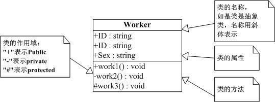

[TOC]

#  第一章 代码无错就是优？--- 简单工厂模式

- 规范    
    - 命名规范
    - 思路，结构清晰 
    - 思考全面
- 面向对象编程
    - 做到容易维护，容易扩展，容易复用
    - 不要用计算机的思考方式来思考程序
    - 通过封装，继承，多态降低程序的耦合度
    - 记住一点：高聚合，低耦合
    - 做到业务分离
- **简单工厂模式：**简单工厂模式不能说是一个设计模式，说它是一种编程习惯可能更恰当些。因为它至少不是23种设计模式之一。但它在实际的编程中经常被用到，而且思想也非常简单，可以说是工厂方法模式的一个引导。
- 定义：**简单工厂模式(Simple Factory Pattern)：**又称为**静态工厂方法(Static Factory Method)模式**，它属于类创建型模式。在简单工厂模式中，可以根据参数的不同返回不同类的实例。简单工厂模式专门定义一个类来负责创建其他类的实例，被创建的实例通常都具有共同的父类。
- UML类图
    - 在类图中一共包含了以下几种模型元素，分别是：类（Class）、接口（Interface）以及类之间的关系。
    - 使用工具：Visio或者processon在线作图
    - 更详细参考[详解UML图之类图](https://www.jianshu.com/p/4cd95d4ddb59)

    **类（Class)**
    
    - 在面向对象（OO) 编程中，类是对现实世界中一组具有相同特征的物体的抽象。
    
     
    
**接口（Interface）**
    
- 接口是一种特殊的类，具有类的结构但不可被实例化，只可以被实现（继承）。在UML中，接口使用一个带有名称的小圆圈来进行表示。
      
      
    
**类图中关系（relation）**
    
- 在UML类图中，常见的有以下几种关系: 泛化（Generalization）, 实现（Realization），关联（Association)，聚合（Aggregation），组合(Composition)，依赖(Dependency)

# 第二章 商场促销 --- 策略模式
- 定义：策略模式定义了算法家族，分别封装起来，让它们之间可以互相替换，此模式让算法的变化不会影响到使用算法的客户。
- 例如：商场促销活动（正常收费，打折收费，满减收费），根据不同的收费方式定义不同的算法类，可以实现同一个协议或者继承同一个抽象父类（抽象父类定义好对外的公开方法），然后根据选择的收费方式，创建对应的算法类。
- 策略模式解析
    - 概念上不同的算法类都是完成的相同的工作（计算出促销活动后的商品总费用），只是内部的实现不同。也就是说策略模式使用的相同的方式调用了所有的算法，减少了各种算法类与需要使用的算法类之间的耦合。
    - 策略模式就是用来封装‘算法’的，实际中可以用它来封装几乎任何类型的规则，只要在分析过程中听到需要在不同的时间应用不同的业务规则，就可以考虑使用策略模式处理这种变化的可能性。
- 思考：**文章中作者是用继承来完成的策略模式的封装，当然这是在java中的应用，我对java不是很熟悉，转OC中的思考，实际上也是能通过继承来实现策略模式的封装的，但是我的想法是：使用OC中的协议（protocol）这个来实现策略模式的封装也是不错的，不同的算法类实现同一个协议（protocol），根据不同的策略方式，来选择创建相应的策略类。这样能减少了创建多余的类文件。**
- 思考2:工作中，大部分需求是一次性的，做完就不会有变化，尤其是逻辑业务的处理，几乎是不会变化的。作为一个移动端的软件开发工程师这一点尤其明显，但是UI层的需求相对而言有些变化，但是结构上不会有太大的变化。那么我应该如何将这种设计模式使用在日常工作中？？？

-----------------------------------

> - 单一职责原则
> - 开放封闭原则
> - 依赖倒转原则
> - 实际上这三个原则都在讲一个东西，怎样让你的代码易维护、易扩展、易复用、灵活多样！

# 第三章 拍摄UFO --- 单一职责原则（SRP）
- 本章一开始作者举例：功能全面的手机和 摄像机，电脑等物品举例说明单一职责的重要性。这个例子的放在当前虽然不合适，但是当年手机功能全面但是效果上确实不尽如人意，这个例子勉强算是合适。
- **单一职责原则（SRP）：**就一个类而言，应该仅有一个引起它变化的原因。
- 如果一个类承担的职责过多，就等于把这些职责耦合在一起，一个职责的变化可能回消弱或者抑制这个类完成其他职责的能力。这种耦合导致脆弱的设计，当发生变化时，设计回遭受到意想不到的破坏。实际上这句话也充分解释了上文提到的为什么要做到`高内聚，低耦合`这句话。`单一职责原则`与`高内聚，低耦合`真的是在互相印证。

# 第四章 考研求职两不误 --- 开放封闭原则（OCP）
- 本章作者通过举例考研和求职可以同时和一国两制的方针延伸出 开放封闭原则（OCP）
- **开放封闭原则（OCP）：**是说软件实体（类、模块、函数等等）应该可以扩展，但是不可修改。
- 特征：1.对于扩展是开放的。2.对于更改是封闭的。
    - 无论模块是多么封闭，都会存在一些无法对之封闭的变化。既然不可能完全封闭，设计人员必须对于他设计的模块的封闭性作出取舍。他必须先猜测出最可能发生变化的种类，然后构造抽象来隔离那些变化。
    - 但是猜测很困难，也可以等到变化发生时立刻采取行动。
    - 最初编写代码时，假设变化不会发生，等到变化发生时，我门就开始创建抽象来隔离以后发生的同类变化。

**代码重构的重要性！！！！！**

# 第五章 会修电脑不会修收音机 --- 依赖倒转原则
- 本章一开始作者用PC机的结构举例说明总结了高内聚低耦合的重要性，然后通过说明CPU、内存、硬盘之间的结构功能关系强行解释了一波 单一职责原则和开放封闭原则。然后通过PC的扩展性引申出了`依赖倒转原则`。
-  **依赖倒转原则：**1.高层模块不应该依赖低层模块。两个都应该依赖抽象。2.抽象不应该依赖细节。细节应该依赖抽象。
-  **里氏代换原则（LSP）：**子类型必须能够替代它们的父类型。
-  依赖倒转其实可以说是面向对象设计的标志，用哪种语言来编写程序不重要，如果编写时考虑的都是如何针对抽象编程而不是针对细节编程，即程序中所有的依赖关系都是终止于抽象类或者接口，那就时面向对象设计，反之就时面向过程化的设计了。

# 第六章 穿什么有这么重要？ --- 装饰模式
- **装饰模式**是为已有功能动态地添加更多功能的一种方式。
- 当系统需要新功能的时候，是向旧的类中添加新的代码。这些新加的代码通常装饰了原有类的核心职责或主要行为（在主类中加入了新的字段，新的方法和新的逻辑，从而增加了主类的复杂度，而新加入的东西仅仅是为了满足一些只在某种特定情况下才会执行的特殊行为的需要）。
    - 优点：
        - 装饰类和被装饰类可以独立发展，不会相互耦合，简化原有的类
        - 有效地把类的核心职责和装饰功能区分开了，并且去除了相关类中重复的装饰逻辑
        - 装饰模式是继承的一个替代模式，装饰模式可以动态扩展一个实现类的功能。
    - 缺点：多层装饰比较复杂。

- 使用场景：
    1. 扩展一个类的功能。 
    2. 动态增加功能，动态撤销。
    
- 注意事项：可代替继承。

# 第七章 为别人做嫁衣 --- 代理模式
- **代理模式：**为其他对象提供一种代理以控制对这个对象的访问。
**分类**
1. 远程代理
    为一个对象在不同的地址空间提供局部代表。这样可以隐藏一个对象存在于不同地址空间的事实。
    例：WebService在.Net中的应用（当我在应用程序的项目中加入一个Web引用，引用一个WebService，此时项目回生成一个WebReference的文件夹和一些文件，其实它们就是一个代理，使得客户端程序调用代理就可以解决远程访问的问题）
2. 虚拟代理
    根据需要创建开销很大的对象。通过它来存放实例化需要很长时间的真实对象。这样可以达到性能的最优。
    例：打开一个很大的HTML网页时，里面很可能有很多的文字和图片，但是你还是可以很快打开它，但是你最先看到的是所有的文字，但是图片是一张一张的显示出来的。那些未打开的图片框就是通过虚拟代理来代替了真是的图片，此时代理存储的是真实图片的路径和尺寸。
3. 安全代理
    用来控制真实对象访问时的权限问题。
4. 智能指引
    当调用真实的对象时，代理处理另外一些事。

**优点：** 
1. 职责清晰。 2. 高扩展性。 3. 智能化。
**缺点：** 
1. 由于在客户端和真实主题之间增加了代理对象，因此有些类型的代理模式可能会造成请求的处理速度变慢。 
2. 实现代理模式需要额外的工作，有些代理模式的实现非常复杂。

**注意事项：** 
1. 和适配器模式的区别：适配器模式主要改变所考虑对象的接口，而代理模式不能改变所代理类的接口。 
2. 和装饰器模式的区别：装饰器模式为了增强功能，而代理模式是为了加以控制。

# 第八章 雷锋依然在人间 --- 工厂方法模式
第十五章还会提到抽象工厂模式

- 简单工厂模式 实现计算器UML类图

- 工厂模式 实现计算器UML类图

- 简单工厂模式的最大优点在于工厂中包含了必要的逻辑判断，根据客户端选择条件动态实例化相关的类。对客户端来说，去除了与具体产品的依赖。
- **工厂方法模式：**定义一个用于创建对象的接口，让子类决定实例化哪一个类。
    - 意图：定义一个创建对象的接口，让其子类自己决定实例化哪一个工厂类，工厂模式使其创建过程延迟到子类进行。
    - 主要解决：主要解决接口选择的问题。
    - 何时使用：我们明确地计划不同条件下创建不同实例时。
    - 如何解决：让其子类实现工厂接口，返回的也是一个抽象的产品。
    - 关键代码：创建过程在其子类执行。

说到这里让我想到iOS中的类簇，但这是基于抽象工厂模式的设计，忍不住现在这里提一点。
    
在iOS开发中NSString，NSNumber等等这些类实际上它们虽然也是一个类，但是不是一个纯粹的类，叫他们类簇更合适。
    
**类簇：**类簇是Foundation框架中广泛使用的设计模式。类簇将一些私有的、具体的子类组合在一个公共的、抽象的超类下面，以这种方法来组织类可以简化一个面向对象框架的公开架构，而又不减少功能的丰富性。*类簇基于抽象工厂设计模式。*（关于抽象工厂模式详见第十五章）

类簇架构代表一个反映简单概念的设计。

类簇中的抽象超类必须声明创建其私有子类的方法。根据调用的创建方法分配正确类型的对象是超类的责任。在Foundation框架中，通常通过调用+ className...或alloc...和init...方法来创建对象。

# 第九章 简历复印 --- 原型模式
- **原型模式：**用原型实例制定创建对象的种类，并且通过复制这些原型创建新的对象。

- 何时使用： 
    1. 当一个系统应该独立于它的产品创建，构成和表示时。 
    2. 当要实例化的类是在运行时刻指定时，例如，通过动态装载。 
    3. 为了避免创建一个与产品类层次平行的工厂类层次时。
    4. 当一个类的实例只能有几个不同状态组合中的一种时。建立相应数目的原型并克隆它们可能比每次用合适的状态手工实例化该类更方便一些。
- 如何解决：利用已有的一个原型对象，快速地生成和原型对象一样的实例。
- 注意事项：与通过对一个类进行实例化来构造新对象不同的是，原型模式是通过拷贝一个现有对象生成新对象的。**注意iOS开发中的浅拷贝和深拷贝。**

# 第十章 考题抄错会做也白搭 --- 模版方法模式
- **模版方法模式：**定义一个操作中的算法的骨架，而将一些步骤延迟到子类中。模版方法使得子类可以不改变一个算法的结构即可重定义改算法的某些特定步骤。
- 模版方法模式时通过把不变行为搬移到超类，去除子类中的重复代码来提现它的优势。相当于提供了一个很好的代码复用平台。
- **主要解决：**一些方法通用，却在每一个子类都重新写了这一方法。
- **优点：**
    1. 封装不变部分，扩展可变部分。 
    2. 提取公共代码，便于维护。 
    3. 行为由父类控制，子类实现。
- **缺点：**每一个不同的实现都需要一个子类来实现，导致类的个数增加，使得系统更加庞大。
- **使用场景：**
    1. 有多个子类共有的方法，且逻辑相同。 
    2. 重要的、复杂的方法，可以考虑作为模板方法。
- **注意事项：**为防止恶意操作，一般模板方法都加上 final 关键词。

# 第十一章 无熟人难办事？ --- 迪米特法则
- “迪米特法则”也叫“最少知识原则”----实际上是在强调类之间的**低耦合**
- **迪米特法则：**如果两个类不必彼此直接通信，那么这两个类就不应当发生直接的相互作用。如果其中一个类需要调用另一个类的某一个方法，可以通过第三者转发这个调用。
    - 在类的结构设计上，每一个类都应当尽量降低成员的访问权限。
    - 类之间的耦合越弱，越有利于复用，一个处在弱耦合的类呗修改，不会对有关系的类造成波及。

迪米特法则可以简单说成：talk only to your immediate friends。 对于OOD来说，又被解释为下面几种方式：一个软件实体应当尽可能少的与其他实体发生相互作用。每一个软件单位对其他的单位都只有最少的知识，而且局限于那些与本单位密切相关的软件单位。

迪米特法则的初衷在于降低类之间的耦合。由于每个类尽量减少对其他类的依赖，因此，很容易使得系统的功能模块功能独立，相互之间不存在（或很少有）依赖关系。

迪米特法则不希望类之间建立直接的联系。如果真的有需要建立联系，也希望能通过它的友元类来转达。因此，应用迪米特法则有可能造成的一个后果就是：系统中存在大量的中介类，这些类之所以存在完全是为了传递类之间的相互调用关系——这在一定程度上增加了系统的复杂度。

**门面模式（Facade）**和**中介模式（Mediator）**，都是迪米特法则应用的例子。

# 第十二章 牛市股票还会亏钱？ --- 外观模式
- **外观模式：**为子系统中的一组接口提供一个一致的界面，此模式定义了一个高层接口，这个接口使得这一子系统更加容易使用。

- 何时使用`外观模式`
    - 设计初期阶段应该有意识的讲两个不同的两个层分离。
    - 在开发阶段，子系统往往因为不断的重构演化而变得越来越复杂，大多数的模式使用时也都会产生很多很小的类，这本是好事，但也给外部调用它们的用户程序带来了使用上的困难，增加外观可以提供一个简单的接口，减少依赖。
    - 在维护一个遗留的大型系统时，可能这个系统非常难以维护了，但是开发新系统又必须依赖它，你可以为你的新系统开发一个外观类，来提供设计粗糙或高度复杂的遗留代码的比较清晰的接口，让新系统与外观类交互，外观类与遗留代码交互所有复杂的工作。

- 主要解决：降低访问复杂系统的内部子系统时的复杂度，简化客户端与之的接口。
- 优点： 1、减少系统相互依赖。 2、提高灵活性。 3、提高了安全性。
- 缺点：不符合开闭原则，如果要改东西很麻烦，继承重写都不合适。
- 使用场景： 1、为复杂的模块或子系统提供外界访问的模块。 2、子系统相对独立。 3、预防低水平人员带来的风险。
- 注意事项：在层次化结构中，可以使用外观模式定义系统中每一层的入口。

# 第十三章 好菜每次回味不同 --- 建造者模式
- **建造者模式（Builder Pattern）：**将一个复杂对象的构建与它的表示分离，使得同样的构建过程可以创建不同的表示。一个 Builder 类会一步一步构造最终的对象。该 Builder 类是独立于其他对象的。
- 意图：将一个复杂的构建与其表示相分离，使得同样的构建过程可以创建不同的表示。
- 何时使用：一些基本部件不会变，而其组合经常变化的时候。

- 关键代码：建造者：创建和提供实例，导演：管理建造出来的实例的依赖关系。
- 应用实例：
    1. 去肯德基，汉堡、可乐、薯条、炸鸡翅等是不变的，而其组合是经常变化的，生成出所谓的"套餐"。 
    2. JAVA 中的 StringBuilder。
- 优点：
    1. 建造者独立，易扩展。 
    2. 便于控制细节风险。
- 缺点： 
    1. 产品必须有共同点，范围有限制。 
    2. 如内部变化复杂，会有很多的建造类。
- 使用场景： 
    1. 需要生成的对象具有复杂的内部结构。 
    2. 需要生成的对象内部属性本身相互依赖。
- 注意事项：与工厂模式的区别是：建造者模式更加关注与零件装配的顺序。

# 第十四章 老板回来，我不知道 --- 观察者模式
- **观察者模式：**又叫做发布-订阅（Publish/Subscribe）模式。实际上这个模式定义了一种一对多的依赖关系，让多个观察者对象同时监听某一个主题对象。这个主题对象发生变化时，会通知所有的观察者对象，使他们能够自己主动更新。

- 将一个系统分割成一系列互相写作的类有一个很不好的副作用，那就是要维护相关的对象的一致性。我们不希望为了位置一致性而使各个类紧密的耦合在一起，这样会给维护、扩展和重用都带来不便。---这个时候就需要用到`观察者模式`了。

- 观察者模式所做的工作实际上就是在解除耦合。让耦合的双方都在依赖于抽象，而不是依赖具体。从而使得各自的变化都不会影响另一边的变化。

- 委托是一种引用方法的类型。一旦委托分配了方法，委托将于该方法具有完全相同的行为。委托方法可以像其它任何方法一样，具有参数和返回值。委托可以看作是对函数的抽象，是函数的「类」。委托的实例将代表一个具体的函数。
    - 在OC中的委托事件称之为delegate，主要依托于协议`『protocol』`。

- 优点： 
    - 1、观察者和被观察者是抽象耦合的。 
    - 2、建立一套触发机制。
    
- 缺点： 
    - 1、如果一个被观察者对象有很多的直接和间接的观察者的话，将所有的观察者都通知到会花费很多时间。 
    - 2、如果在观察者和观察目标之间有循环依赖的话，观察目标会触发它们之间进行循环调用，可能导致系统崩溃。 
    - 3、观察者模式没有相应的机制让观察者知道所观察的目标对象是怎么发生变化的，而仅仅只是知道观察目标发生了变化。
    
    

# 第十五章 能不换DB吗？ --- 抽象工厂模式

# 参考地址
[设计模式参考地址](http://www.runoob.com/design-pattern/design-pattern-tutorial.html)

